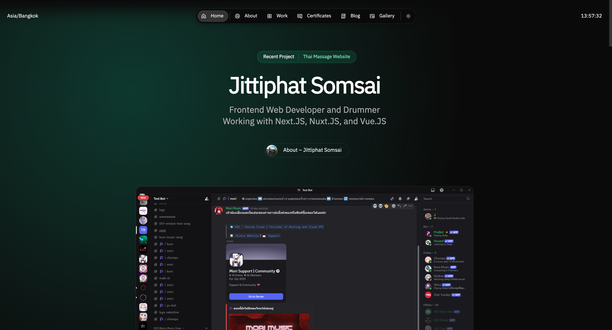

# **My Website | Next.JS + Tailwind CSS + Once-Ui + Lenis**

View the [demo here](https://jittiphat.space).




# **Getting started**

**1. Clone the repository**
```
git clone https://github.com/Jittiphatz/jittiphat.space.git
```

**2. Install dependencies**
```
npm install
```

**3. Run dev server**
```
npm run dev
```

**4. Edit config**
```
src/app/resources/config
```

**5. Edit content**
```
src/app/resources/content
```

**6. Create blog posts / projects**
```
Add a new .mdx file to src/app/blog/posts or src/app/work/projects
```
